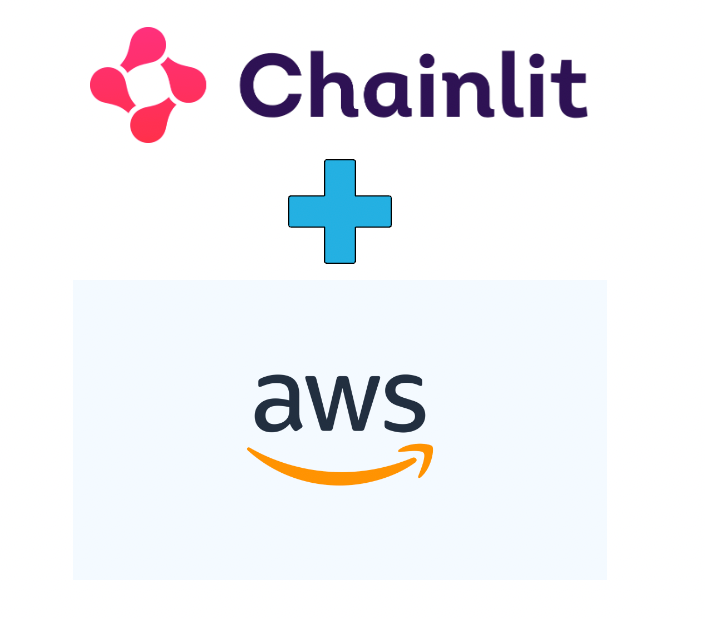

🔗💡*Chainlit is an open-source Python package that allows you to create ChatGPT-like UIs on top of any Python code in just minutes! Visit the [GitHub repo](https://github.com/Chainlit/chainlit) to get started!*

**This post is designed to guide you through deploying your Chainlit apps to AWS ECS.**

In this tutorial, we'll be using this [sample example](https://github.com/garg-ankush/cookbook/tree/aws-ecs-deployment/aws-ecs-deployment). Feel free to use your own application instead.

Prerequisites:

1. Python ≥ 3.9
2. AWS account
3. Docker

# Table of Contents
1. [Create an AWS account and set up credentials 🚀](#Setup)
2. [Clone the repo - bypass if you already an ongoing chainlit project 🧫](#Clone)
3. [Dockerfile 🐳](#Dockerfile)
4. [Run the Chainlit app locally 🏡](#Locally)
5. [Create ECR and push the image 📌](#ECR)
6. [Create task definition and service and run task 🏃🏼‍♀️](#RunTask)
7. [Test out the application 💯](#Test)
8. [Ideas for next steps 🪜](#NextSteps)

## Step 1: Create an AWS account and set up credentials 🚀 <a name="Setup"></a>

Follow steps in this [blog post](https://awscli.amazonaws.com/v2/documentation/api/latest/reference/configure/index.html) by AWS to configure AWS CLI.

## Step 2: Clone the repo - bypass if you already an ongoing chainlit project 🧫 <a name="Clone"></a>

```bash
git clone https://github.com/Chainlit/cookbook.git chainlit-cookbook
```

Navigate to the app folder:

```bash
cd chainlit-cookbook/aws-ecs-deployment
```

## Step 3: Dockerfile 🐳 <a name="Dockerfile"></a>

```python
# Use an appropriate base image, e.g., python:3.10-slim
FROM python:3.10-slim

# Set environment variables (e.g., set Python to run in unbuffered mode)
ENV PYTHONUNBUFFERED 1

# Set the working directory
WORKDIR /app

# Copy your application's requirements and install them
COPY requirements.txt /app/

RUN pip install -r /app/requirements.txt

# Copy your application code into the container
COPY . /app/

EXPOSE 8080

CMD ["python", "-m", "chainlit", "run", "app.py", "-h", "--port", "8080"]
```

**❗ If you’re on Mac M1, replace the first line in Dockerfile with `FROM --platform=linux/amd64 python:3.9-slim`**

> Our app is exposed on port 8080. We’ll be using this port in multiple locations.> 

## Step 4: Run the Chainlit app locally 🏡 <a name="Locally"></a>

🚧 Make sure Docker Daemon is running.

First, build the docker image and test that the app works locally.

```docker
docker build -t chainlit-app:latest .
```

Here’s what it looks like for me.

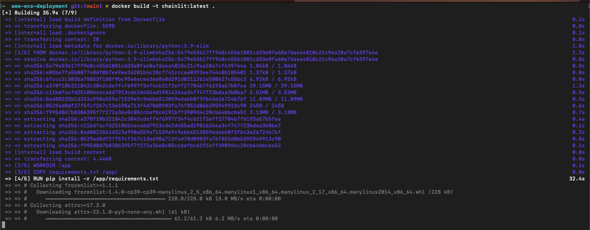

Now, let’s confirm that the image was built successfully.

```docker
docker images
```

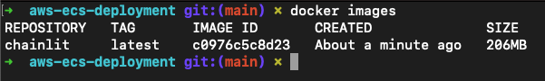

Let’s run the app locally and navigate to [`localhost:8080`](http://localhost:8080) 🥂

```python
docker run -p 8080:8080 chainlit:latest
```


## Step 5: Create ECR and push the image 📌 <a name="ECR"></a>

Let’s head over to AWS ECR and create a repository where we’ll push our docker image to.


Once a repository is created, let’s push an image to it. Head over to the repository and click `View push commands`.


Let’s follow the helper commands to push our image to the `Chainlit-demo-app` repository we just created.

🚧 Note, we already created built an image to test the app locally. But that’s ok, let’s rebuild the image again to avoid confusion.


Awesome, this is what it looks like on my end.

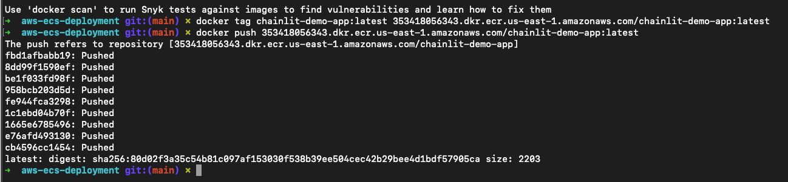

Let’s see if we find the image on AWS.

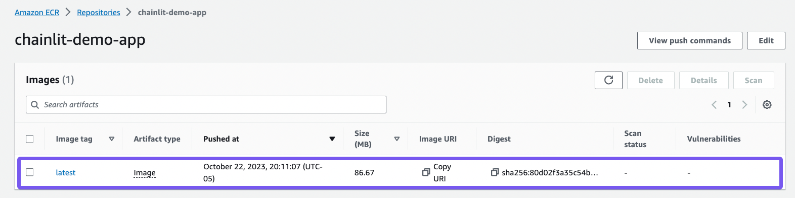

🚧 Take note of the image URI - we’ll need it later.

Great, our repository and our image is set. Let’s head over to ECS to create a service and a task.

## Step 6: Create task definition and service and run task 🏃🏼‍♀️ <a name="RunTask"></a>

### Create a new cluster

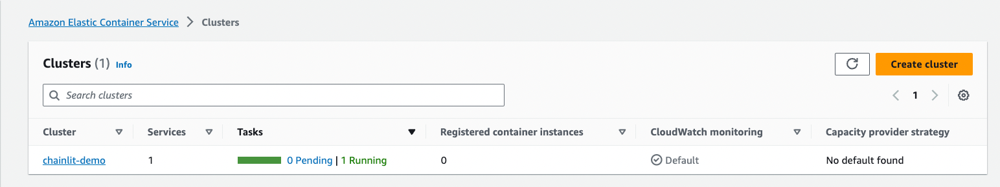

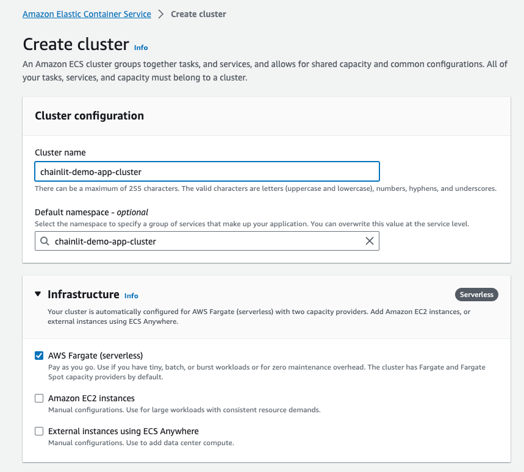

Click create and we should see a new cluster `chainlit-demo-app-cluster` has been created for us.

### Create a task definition

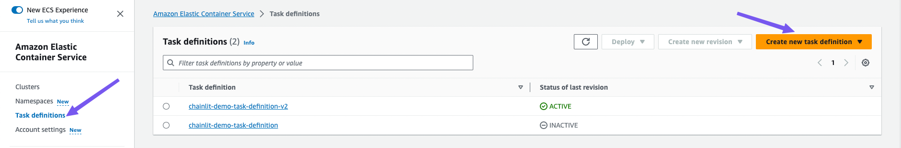

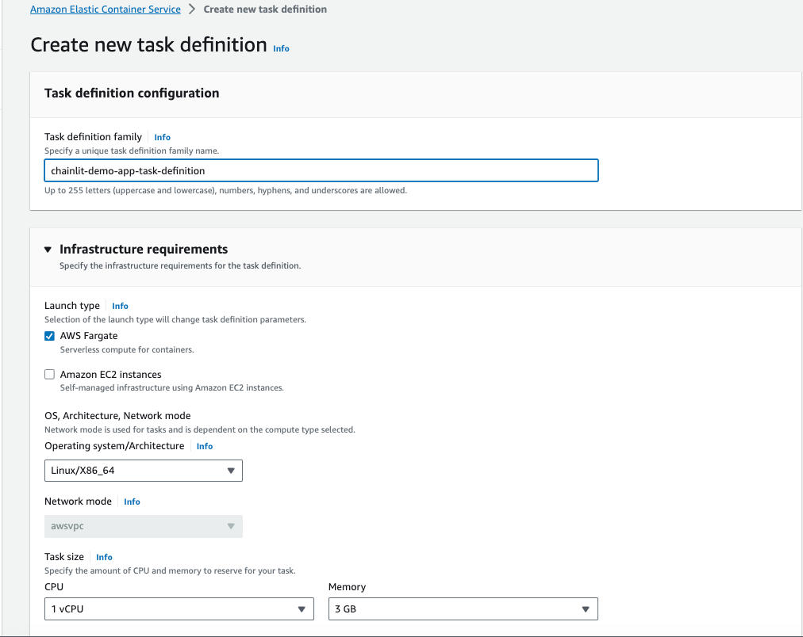

🚧 Make sure the container port matches the port we exposed in the Dockerfile.

Leave everything else as default and create our task definition.


### Create a service


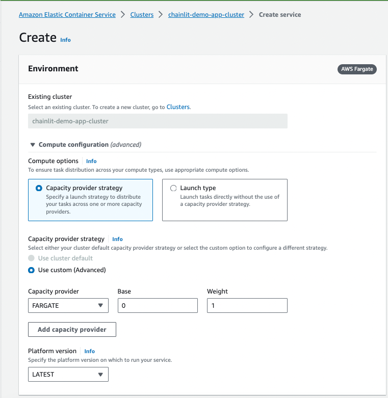

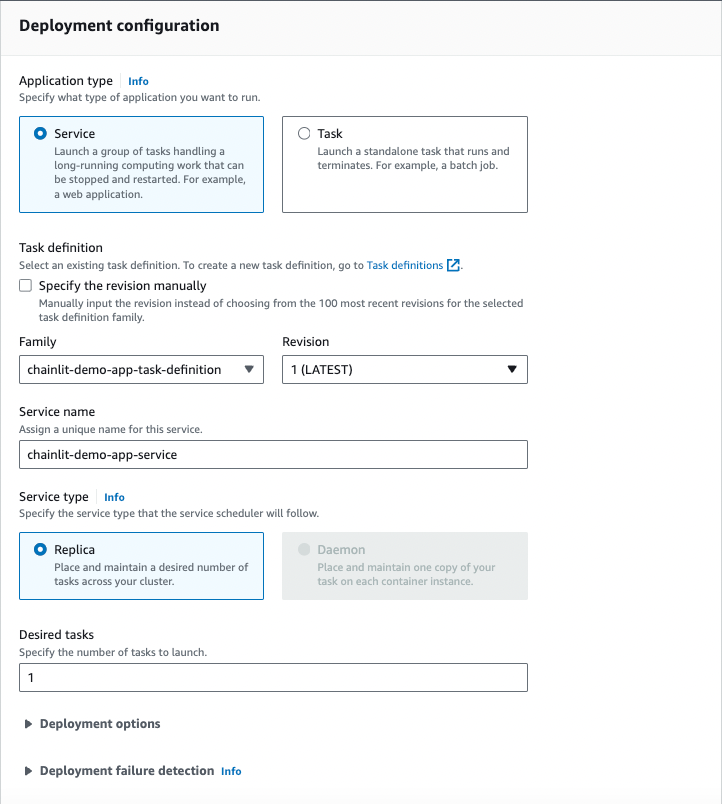

We should be good to create our service. Let’s hit it 👊🏼

🚧 It may take a few minutes for the service to be ready.

Map the ports correctly.

**❗ One last thing we need to do before our task is ready is to allow traffic to the right port. You may have these set up already but if not, set the ports so that you allow all incoming traffic to port 8080.**

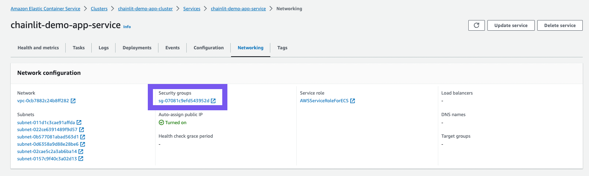

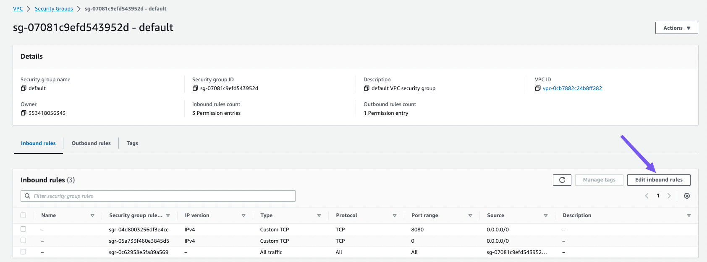


Your task should be running at this point. Head over to the tasks tab of the `chainlit-demo-app-service` .

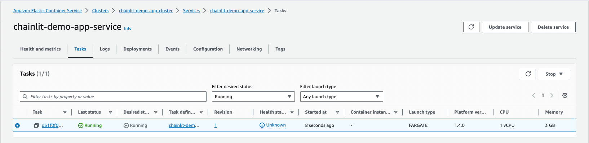


🚧 Our app is exposed at this public IP: `52.204.71.81:8080`

## Step 7: Test out the application 💯 <a name="Test"></a>

Head over to the public IP in the browser to see our app in action!

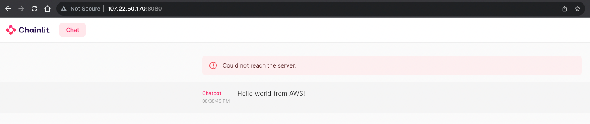

## Step 8: Ideas for next steps 🪜 <a name="NextSteps"></a>

1. We have our app running on a weird public IP address - we can connect it to our own domain.
2. Load Balancer - Will give us a better performance and high availability.
3. Right now our is not very secure. AWS Certificate Manager makes getting an SSL certificate relatively straightforward.

I hope this helps the growing Chainlit community! Hit me up in the Chainlit Discord (ankushgarg) if you have any questions about the walkthrough.

**Resources:**

[Deploy to Fly.io](https://dev.to/willydouhard/how-to-deploy-your-chainlit-app-to-flyio-38ja)

[Deploy to GCP](https://pseudohvr.medium.com/deploying-chainlit-on-gcp-72231ba6b77f)